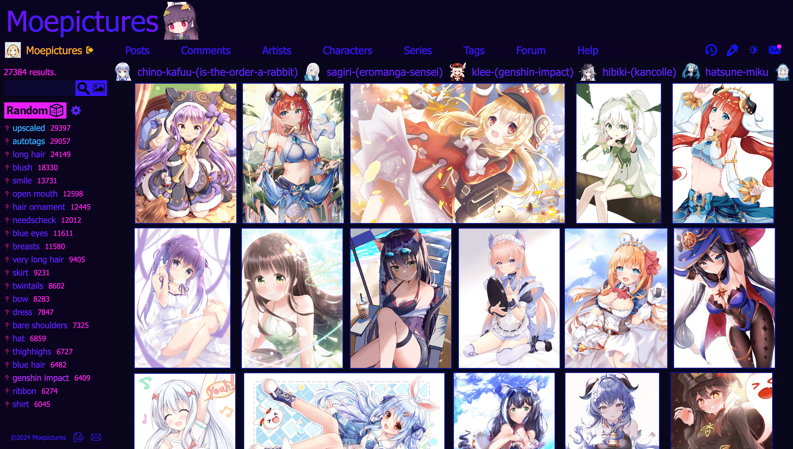
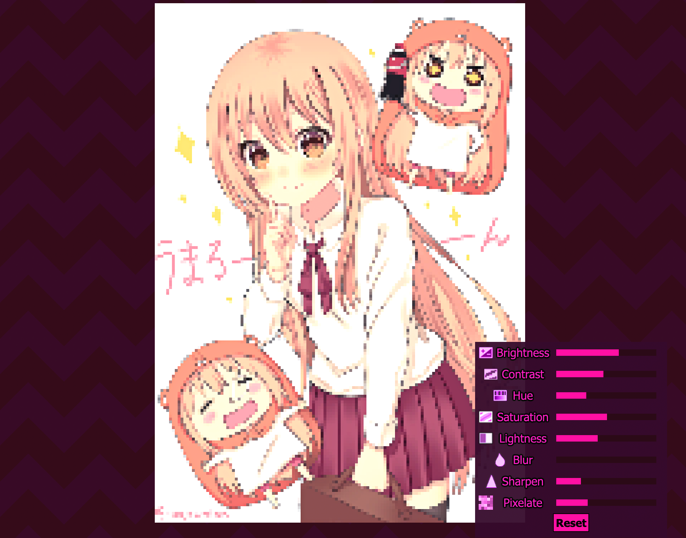
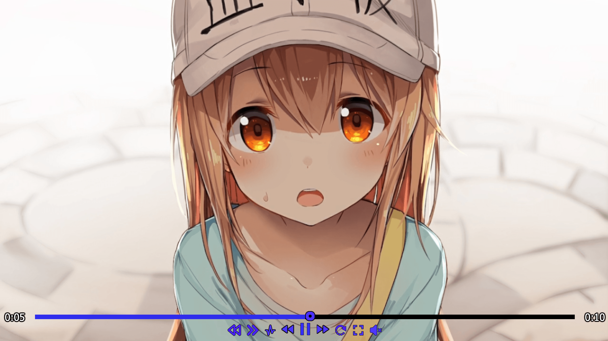
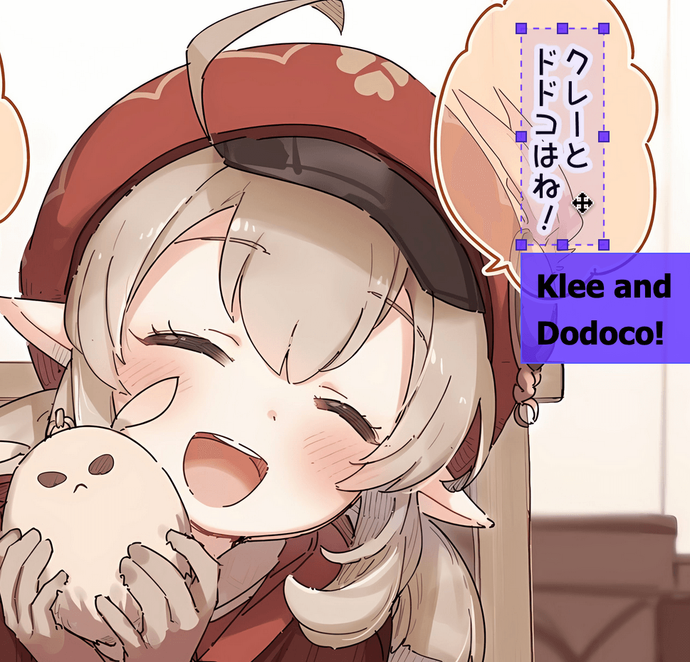

# Moepictures.moe

Moepictures is an image board site for cute anime art, organized by tags.



### Searching With Spaces

Moepictures's tags use the dash ("-") as the delimeter, but the search can guess what tags you are looking for even if you use spaces.

### Multiple Images Per Post

Moepictures supports multiple images per post, which is great for comics and posts with lots of variations. We also have parent/child relationships and groups.

### Image Filters



You can apply image filters such as brightness, contrast, and hue in realtime. There is also a very fun pixelate filter that 
can make everything look like a pixel game. When playing audio, the pixelate filter will work as a bitcrusher.

### Custom Players

Moepictures uses custom gif/video/music/3d/live2d players, so you can do many things that aren't normally possible like pausing/seeking 
gifs, reverse playback, and modification of playback speed. 

Video Player:



The video player has some additional controls for volume and pitch preservement. The 3d model player has 
controls for wireframe, matcap, shapekeys, and lighting. The music player can playback audio in reverse. The 
live2d player has controls for speed, parameters, and parts.

### Notes



As often images might contain japanese text, adding and viewing notes for translations is also supported!

### Self-hosting

First you will need to download all of these.

- Node.js v23: https://nodejs.org/en/
- PostgreSQL v16: https://www.postgresql.org/
- Redis v7: https://redis.io/

Clone the project:
```
git clone https://github.com/Moebits/Moepictures.moe.git
```

Rename the file `.env.example` to `.env` and put in your credentials. `COOKIE_SECRET` should be any string of random characters. `EMAIL_ADDRESS` and `EMAIL_PASSWORD` is the email address used to send people email verification emails, password resets, etc.

To add files locally create folders "moepictures" and "moepictures-unverified" and add the path to `MOEPICTURES_LOCAL` and `MOEPICTURES_LOCAL_UNVERIFIED`, each containing the following subfolders:

`["image", "comic", "animation", "video", "audio", "model", "live2d", "artist", "character", "series", "tag", "pfp", "thumbnail"]`

The site runs on port 8082 by default but it can be configured by changing `PORT`.

Install all of the dependencies for this project by running `npm install`. \
Start the project by running the server `npm start`.

#### Live2D
To enable live2d support, you need to download the proprietary Cubism Core library and place it in `assets/live2d`.
https://www.live2d.com/en/sdk/download/web/

That's pretty much it. Following our license (CC BY-NC 4.0) you may not commercialize self-hosted instances.
