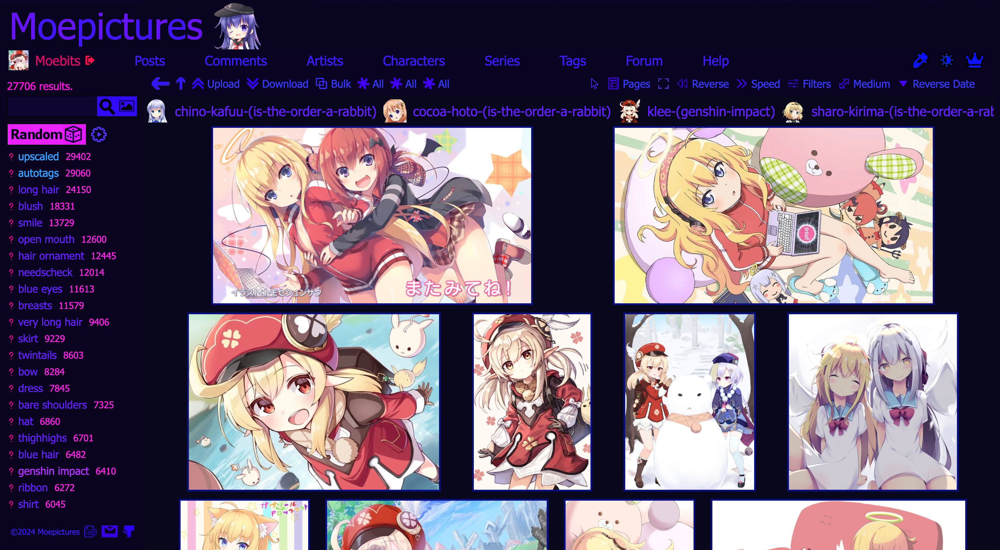
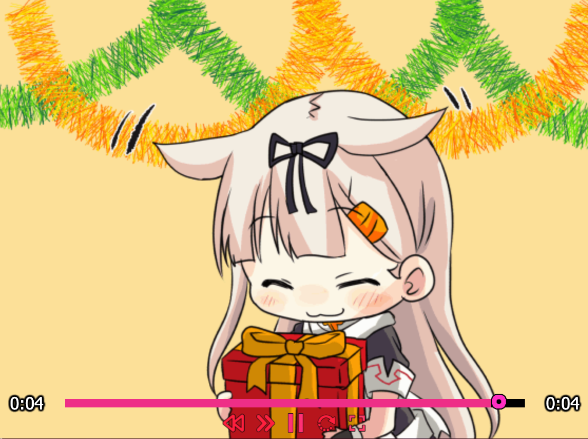
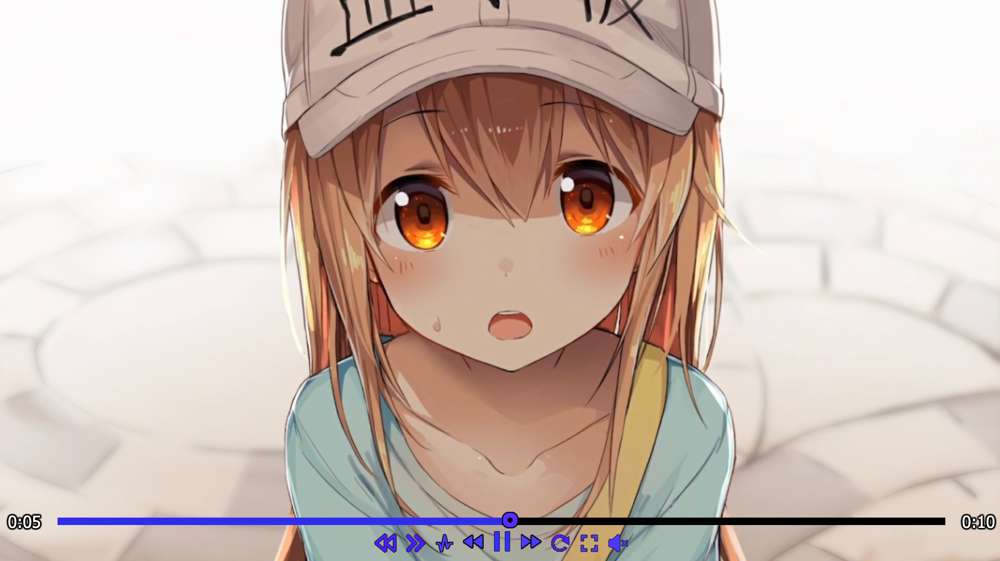
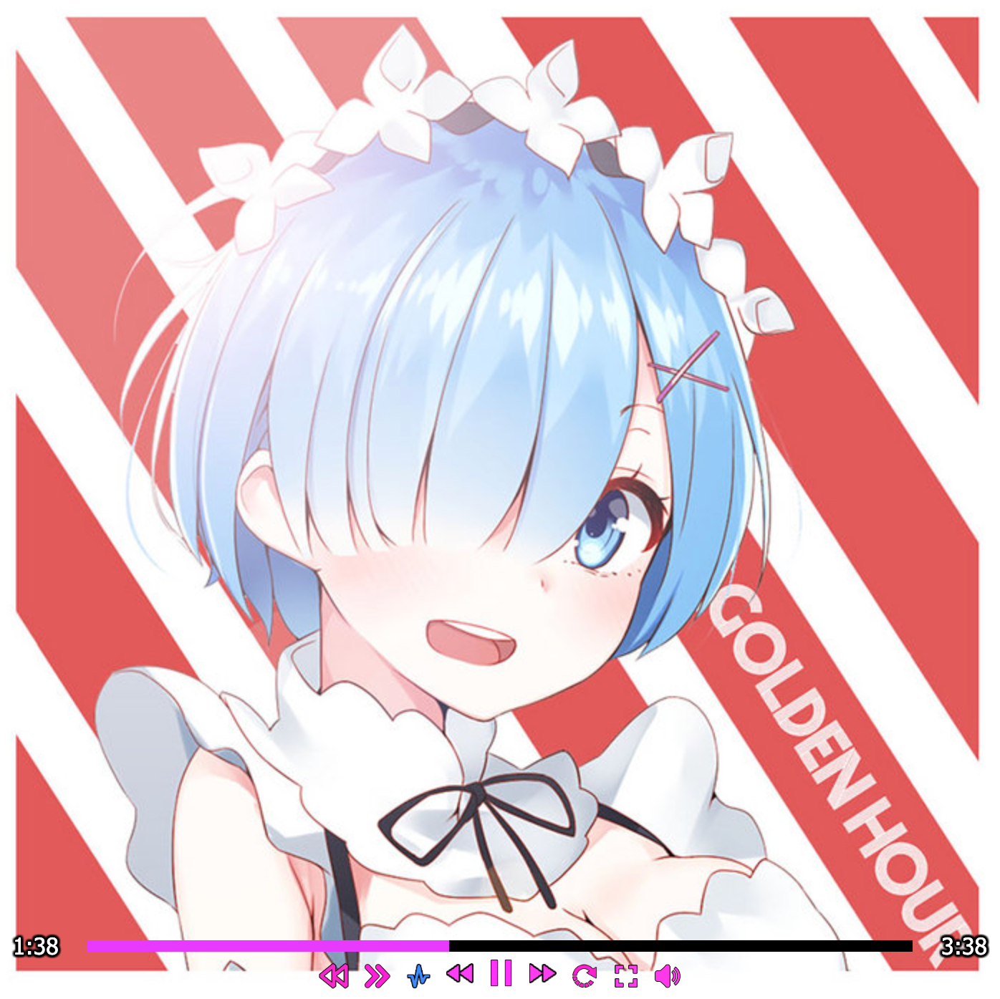
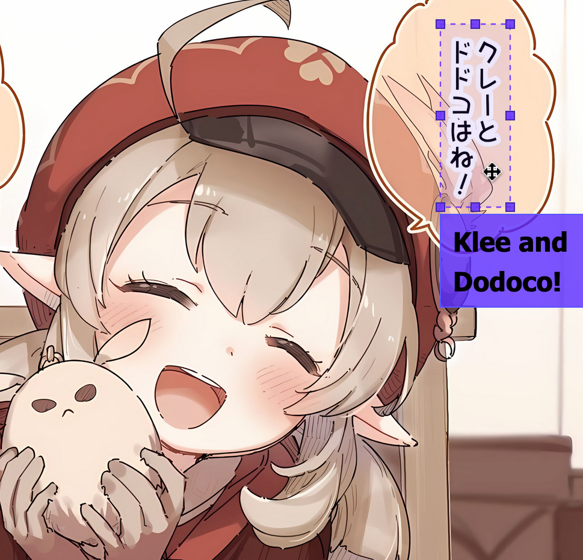

# Moepictures.moe

**Update - 3/8/2023**
I took down the online website because I can't afford the hosting costs. You can still run it locally using your own database and images. 

Moepictures is an image board site for cute anime art, organized by tags.

### Searching With Spaces

Moepictures's tags use the dash ("-") as the delimeter, but the search can guess what tags you are looking for even if you use spaces.

### Multiple Images Per Post

Moepictures supports multiple images per post, which is great for comics and posts with lots of variations. We also have parent/child relationships for third-party posts.

### Image Filters

You can apply image filters such as brightness, contrast, and hue in realtime. There is also a very fun pixelate filter that 
can make everything look like a pixel game. When playing audio, the pixelate filter will work as a bitcrusher.

### Custom Players

Moepictures uses custom gif/video/music/3d players, so you can do many things that aren't normally possible like pausing/seeking 
gifs, reverse playback, and modification of playback speed. 

GIF Player:

Video Player:

3D Model Player:

Music Player:

The video player has some additional controls over the gif player, such as volume and pitch preservement. The 3d model player has 
controls for wireframe, matcap, shapekeys, and lighting. The music player can playback audio in reverse.

### Translations

As often images might contain japanese text, adding and viewing translations is also supported!

### Tech Stack

- Languages: Typescript, LESS, HTML, SQL
- Front-end: React
- Bundler: Webpack
- Back-end: Node
- Database: PostgreSQL
- Hosting: AWS

### Self-hosting

If you want to self host this website the first step is to clone the code and install Node.js v20.11.1 (a newer version might have breaking changes and is not guaranteed to work).

https://nodejs.org/en/ 

The database used is PostgreSQL v14. You should create a new database but you don't need to create any tables as they are created automatically if they don't exist.

https://www.postgresql.org

Images are uploaded to Amazon S3 buckets called "moepictures" and "moepictures-unverified", you should create two buckets with these names.

https://aws.amazon.com/s3/

If you want to use the local filesystem instead you can edit the file `structures/ServerFunctions.ts` and add in your path to folders "moepictures" and "moepictures-unverified", each containing the following subfolders:

`["animation", "artist", "character", "comic", "image", "pfp", "series", "tag", "video", "audio", "model"]`

Rename the file `.env.example` to `.env` and this is where you should put in your database and aws credentials. `COOKIE_SECRET` should be a string of random characters. `EMAIL_ADDRESS` and `EMAIL_PASSWORD` is the email address used to send people email verification emails, password resets, etc.

In production you should set the `PORT` to 80 (HTTP port) or 443 (HTTPS port). For development omit this and it runs on port 8082 by default.

The other keys in this file are largely optional, for example if you want to fetch data from saucenao in the upload page you should provide a saucenao api key.

Install all of the dependencies for this project by running `npm install`. \
Build the project by running `webpack`. \
Start the project by running the server `node dist/server.js`.

The script `npm start` is a shorthand for building and starting the project. \
In production, you should run this file with pm2 so it automatically restarts if for some reason there was an error: `pm2 start dist/server.js`.

That should be it!
